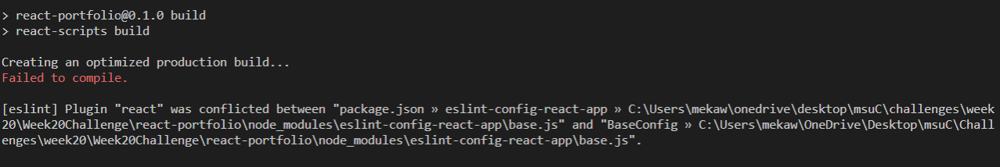
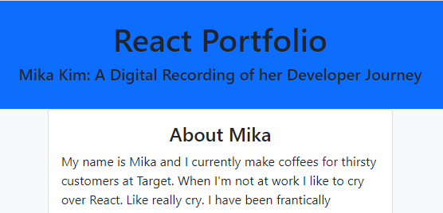

# React Portfolio

## Purpose
The purpose of this project is to be able to present a single-page application portfolio to prospective employers or collaborators. 

## Built With
- React /s
- Node.js
- Bootstrap

## Why It Doesn't Work
There is a lot of room for me to improve this project. I need to revist useState and UseHook because I think I was getting confused and making frustrating errors. This will improve with more practice with the React file structure and remembering to only call hooks on the top level. I also made a lot of dumb mistakes by not keeping track of what directory I was in when installing and calling run scripts in the terminal. When I realized I was running out of time, I decided that it was most important to me to have a page that deployed, so I commented out and deleted a lot of code to get back to a place where "npm run" compiled the website. I then updated my package.json and ran `npm run deploy` only to get this error screen after all of that work. 

I will be back to update and fix this portfolio. I think I just need more practice with some smaller React projects first.

## Link to Deployed Application
[Link] (https://mikak02.github.io/Week20Challenge/)

## Screenshot
A screenshot to prove that at one point I had something on the screen.

